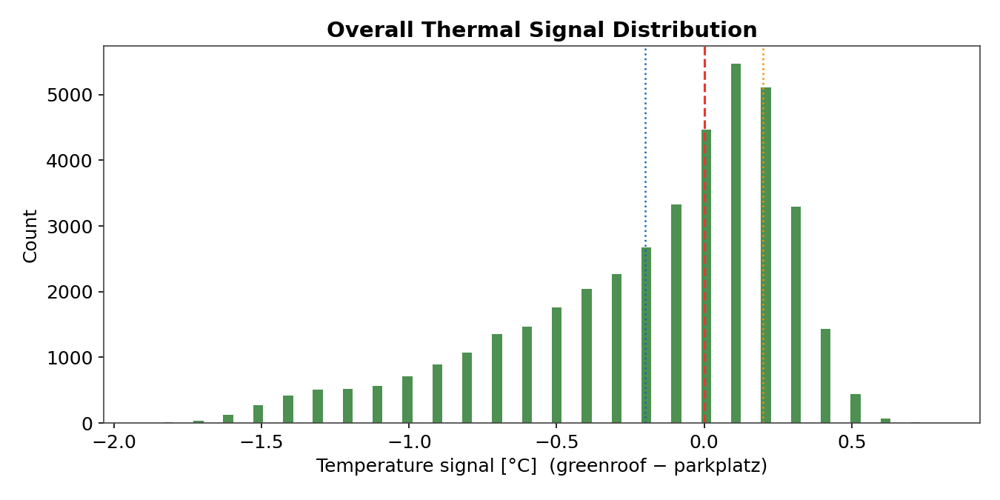
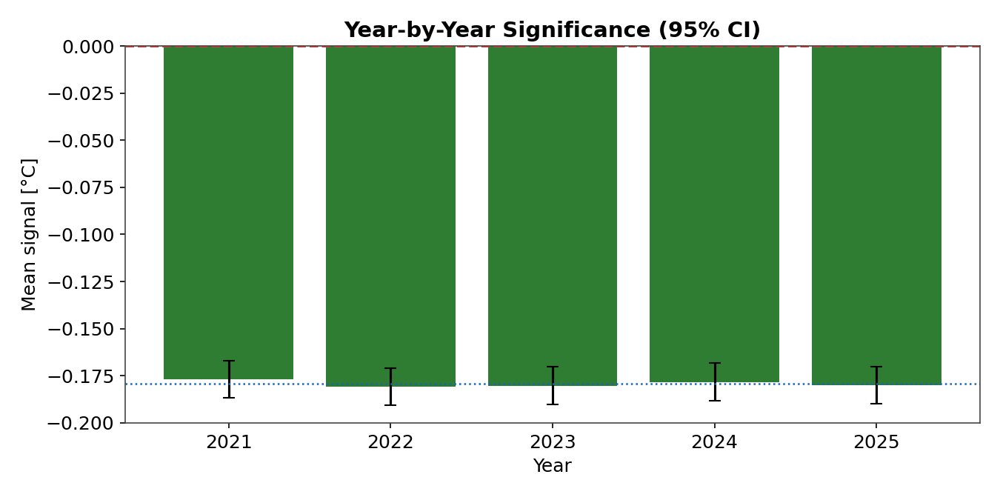
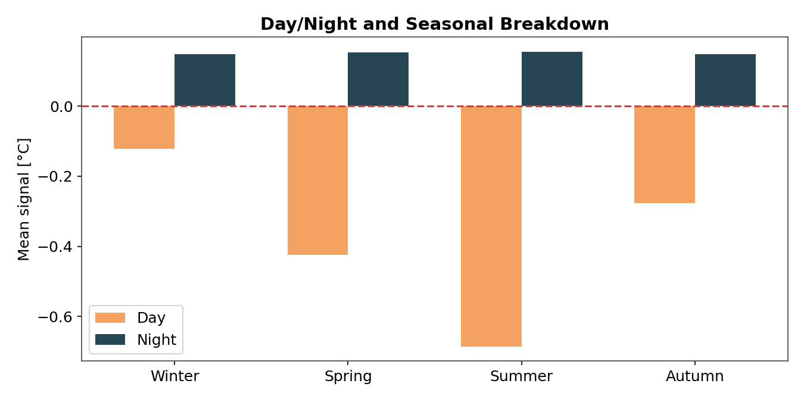

# Bingen Greenroof ETL Pipeline

A production-style ETL pipeline and analytics dashboard that turns raw, multi-vendor environmental sensor exports into a statistically-analyzed time series of green roof cooling performance. Built for MSc thesis research on urban green roof thermal behavior.

**Live demo:** [bingen-greenroof-etl-pipeline.streamlit.app](https://bingen-greenroof-etl-pipeline-4ads4zvvdgfzzc36labs6p.streamlit.app/)
**Note:** all data in this repository is synthetic — see [Data](#data) below.



## Overview

Two field sites — a vegetated green roof and a paved reference parking lot — each report minute-level sensor readings from two independent logger vendors, plus an optional network of black-globe temperature loggers. This pipeline ingests years of those raw exports (three different file formats, inconsistent schemas, routine incremental drops), reconciles them into a single canonical schema, synchronizes everything to a common minute-level timeline, and serves the result through an interactive dashboard that tests whether — and when — the green roof actually cools the air above it.

## Architecture

```
raw CSV / .dat exports                    harm_greenroof ─┐
(Empower, Kissel/MXmini,                   harm_parkplatz ─┼─ SYNC (minute join) ─ synchronized_data_filtered
 Campbell Scientific TOA5)                 harm_black_globes ┘        │
        │                                                             │
        ▼                                                             ▼
   1. INGEST  ──▶  2. QC FILTER  ──▶  3. HARMONIZE            4. above            5. PARTITION (yearly)
  (incremental,       (sensor           (canonical                                        │
   file-manifest       bounds)           schema per                                       ▼
   tracked)                              vendor)                              DuckDB warehouse ──▶ Streamlit dashboard
```

1. **Ingest** — parses each vendor's raw format (positional CSV columns, German decimal commas, Campbell Scientific TOA5 headers) into per-source tables. Incremental: a file is only re-parsed if its size or modified-time has changed since the last run, tracked in a file manifest.
2. **QC filter** — applies sensor-specific physical bounds (temperature, humidity, radiation, pressure ranges) per source.
3. **Harmonize** — maps each vendor's column names onto one canonical schema so Empower and Kissel/MXmini readings become directly comparable.
4. **Synchronize** — joins green roof and parkplatz data per minute (`INNER JOIN` — both required, since the comparison needs both sites) and left-joins the optional black-globe network (`LEFT JOIN` — enrichment only, its absence never drops a minute). Derives the physical metrics the dashboard runs on: temperature-difference signal, radiation balance, albedo, and specific-humidity gradient (as an evapotranspiration proxy).
5. **Partition** — splits the final table into yearly partitions for query performance at scale.

## Engineering highlights

- **Incremental, idempotent ingestion** — re-running the pipeline against a folder of thousands of files only touches the ones that actually changed.
- **Atomic staged-build-verify-swap deploys** (`scripts/run_update.py`) — a production update builds into a staging database file, verifies it, and only then atomically swaps it in as the live database. A failed or interrupted run never leaves the live dashboard broken.
- **Multi-vendor format reconciliation** — two sensor vendors (Empower, Kissel/MXmini) export structurally different files for the same physical measurements; the ingest layer sniffs format by content (not filename) and harmonizes both into one canonical schema.
- **Backbone vs. enrichment join semantics** — the sync stage deliberately uses `INNER JOIN` for the two sites that *must* both be present for a comparison to mean anything, and `LEFT JOIN` for the black-globe network, which is optional context that should never silently drop otherwise-good data.
- **Physical metrics computed in SQL** — radiation balance, albedo, and specific humidity (Magnus formula) are derived directly in the synchronization query rather than post-hoc in the dashboard, so every consumer of the warehouse sees the same numbers.

## Dashboard

An 11-tab Streamlit dashboard for exploring the synchronized dataset: year-by-year cooling significance (95% CI), seasonal and day/night breakdowns, an energy-balance diagnostic (radiation, albedo, sensible/latent heat proxies), and a case-study-day drill-down at minute resolution.

| Year-by-year significance (95% CI) | Day/night × seasonal breakdown |
|---|---|
|  |  |

## Tech stack

Python · DuckDB · SQLAlchemy · Streamlit · Plotly · pandas · NumPy

## Running it locally

```bash
git clone <this-repo-url>
cd bingen_greenroof_ETL_pipeline
setup.bat              # creates .venv, installs requirements.txt
"Open Dashboard.bat"   # launches the dashboard against the committed demo database
```

The repository ships with a pre-built database (`outputs/bingen_greenroof.duckdb`) generated from the synthetic data below, so the dashboard works immediately after setup with no pipeline run required.

To see the pipeline itself run end-to-end:

```bash
.venv\Scripts\python.exe scripts\run_pipeline.py --yes
```

See `instructions/QUICK_START.md` for the full CLI reference and `instructions/PIPELINE_GUIDE.md` for stage-by-stage details.

## Data

**Every file under `data/raw/` in this repository is synthetically generated** — diurnal and seasonal sine curves plus random noise, written out in the exact raw formats the ingest code expects. See [`data/raw/SYNTHETIC_DATA_NOTICE.md`](data/raw/SYNTHETIC_DATA_NOTICE.md) and [`scripts/generate_synthetic_data.py`](scripts/generate_synthetic_data.py).

This is a portfolio copy of a pipeline originally built on a research lab's real sensor data for an MSc thesis. That underlying data is not published here or anywhere public.

## License

MIT — see [LICENSE](LICENSE).
